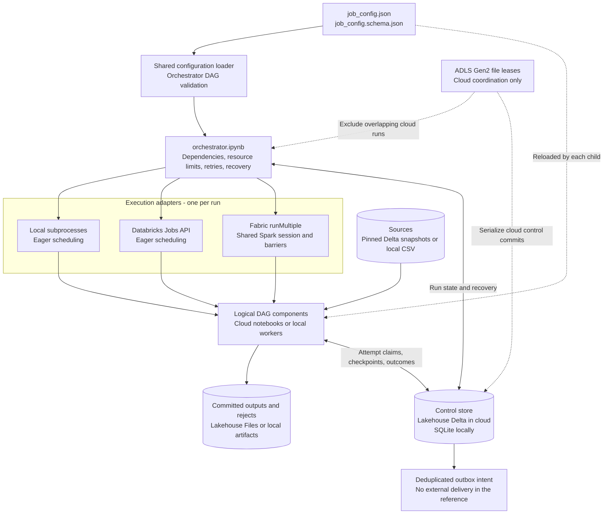
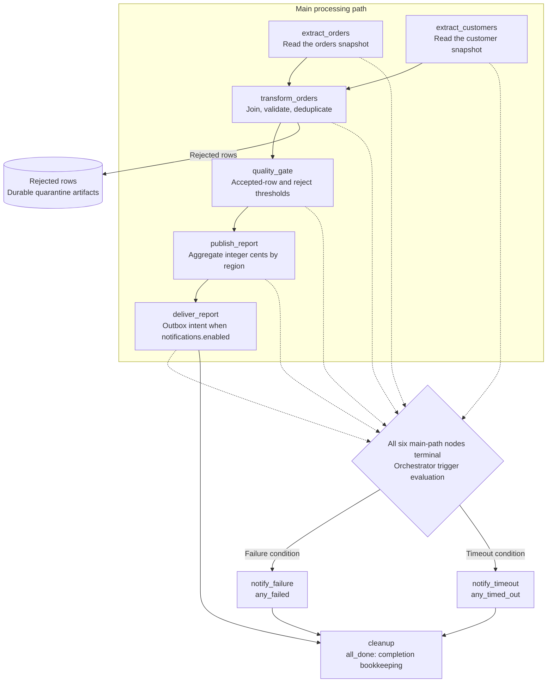

# Restartable Spark notebook DAG

A portable reference runtime for **Microsoft Fabric**, **Databricks**, and local
failure/recovery testing. Orchestration is separate from the sample sales
transformations. Cloud state and data use **Lakehouse Delta tables and ADLS Gen2
paths**, coordinated by **ADLS Gen2 file leases**. Local runs use transactional
SQLite.

**This is not a completed DataStage conversion.** No DataStage export, sequence,
routine, script, or source-system specification has been supplied. The sample
lineage is explicitly labeled `SAMPLE::...`. See [the assessment](assessment.md)
for the artifacts needed to perform the actual conversion. Cloud adapters need
deployment-specific acceptance testing; no cloud resources are provisioned here.

## Run the reference DAG

From this deployment folder, in PowerShell:

```powershell
python -m venv .venv
.\.venv\Scripts\python.exe -m pip install -e ".[test,cloud]"
.\.venv\Scripts\python.exe -m spark_dag validate
.\.venv\Scripts\python.exe -m spark_dag run --business-run-key 2026-09-24
```

The local executor launches real child processes and terminates/reaps them on
timeout. It uses the same configuration, business components, state machine,
checkpoint validation, and retry policies as the notebook entry points, but uses
Python reference transformations rather than requiring Spark. It is a test
runner, **not a distributed SQLite deployment option**.

Expected report: North = **1,500 cents / 2 orders**, South = **2,050 cents / 1 order**.
One exact duplicate is collapsed; one unknown customer and one negative amount
are rejected. Delivery creates a deduplicated **outbox intent**, not an email or
external file transfer. Outputs and control state are under `.runtime`.

## Architecture

### Runtime and storage

The orchestrator selects one execution adapter per run. All child notebooks
reload the shared configuration and use the same claim, validation, and
checkpoint contract; local subprocesses execute the corresponding Python
components. This view shows runtime relationships, not additional DAG nodes.



### Processing DAG

The nine notebook nodes below match `job_config.json`. Solid edges inside the
main path are success dependencies; dotted edges report terminal states to
the orchestrator's trigger evaluation.



The terminal-state diamond is a logical barrier, **not another notebook**.
Inactive notice branches become `SKIPPED_CONDITION`; cleanup waits for delivery
and both notices to reach terminal states. An unconfirmed cloud termination
instead stops further dispatch for operator reconciliation. Cleanup records
bookkeeping and does not delete shared data or checkpoints.

## Recovery

Use the failed run ID from the JSON summary:

```powershell
.\.venv\Scripts\python.exe -m spark_dag run --business-run-key 2026-09-24 --mode resume --parent-run-id "<failed-run-id>" --reason INC-123
.\.venv\Scripts\python.exe -m spark_dag run --business-run-key 2026-09-24 --mode force_restart --parent-run-id "<latest-run-id>" --restart-from transform_orders --reason CHG-124
.\.venv\Scripts\python.exe -m spark_dag run --business-run-key 2026-09-24 --mode force_rerun --reason CHG-125
```

**Force restart** invalidates the selected node/checkpoint and its descendants.
**Force rerun** repeats every currently eligible node, but does not bypass
non-idempotent approval, compensation, or side-effect deduplication.
An already-used business key is rejected in normal mode. Configuration/code,
dependency state, input snapshots, outputs, and final checkpoints are checked
before any `SKIPPED_ALREADY_SATISFIED` result.

## Deployment folder

| Artifact | Purpose |
|---|---|
| `orchestrator.ipynb` | Parameterized orchestrator entry point |
| `notebooks/*.ipynb` | One entry point per logical sample component |
| `child_template.ipynb` | Contract-preserving starting point for a real converted component |
| `job_config.json` / `job_config.schema.json` | Sidecar and strict versioned schema |
| `dag_manifest.json` | Generated lineage, policies, edges, and deterministic plan |
| `spark_dag/` | Loader, validator, scheduler, control store, leases, adapters, artifacts, business logic |
| `sample_data/` | Small synthetic landed snapshots, never production data |
| `tests/` / `tools/run_tests.py` | Configuration, DAG, concurrency, recovery, adapter, and Spark checks |
| `test-results.json` | Recorded results and explicit validation scope |
| [validation.md](validation.md) | Observed results, failure-injection matrix, and requirement coverage |
| [performance.md](performance.md) | Scheduling benchmark, I/O reductions, and capacity constraints |
| [design.md](design.md) | Contracts, state/control design, integrity, capacity, and platform differences |
| [deployment.md](deployment.md) | Local, Fabric, and Databricks deployment steps |
| [runbook.md](runbook.md) | Failure injection, restart, quarantine, and operator recovery |
| [assessment.md](assessment.md) | DataStage intake, sample mapping, assumptions, and unresolved decisions |

The sidecar lives at the **deployment root**, shared by the orchestrator and the
`notebooks` subfolder. Every notebook uses the same loader; it never embeds its
own environment configuration. A different sidecar filename or an absolute
resolved path can be passed at runtime. All hosts must see the same immutable
deployment release.

## Automated checks

```powershell
.\.venv\Scripts\python.exe -m ruff check spark_dag tests tools
.\.venv\Scripts\python.exe tools\run_tests.py --output test-results.json
```

Real PySpark checks additionally require **Java 17 or 21**, the declared
`spark-test` extra, and a working local Spark environment:

```powershell
.\.venv\Scripts\python.exe -m pip install -e ".[test,cloud,spark-test]"
.\.venv\Scripts\python.exe tools\run_tests.py --spark --delta --output test-results.json
```

The `--spark` flag makes Spark setup/test failures fail the suite rather than
quietly skipping them. Without it, Spark tests are explicitly reported as
skipped. `--delta` additionally exercises real Delta transactions and immutable
output validation; it needs Maven access for the declared Delta jars. Unit
tests exercise cloud API contracts using fakes; this is not proof
of live Fabric, Databricks, OneLake, Delta-on-cloud, or ADLS Gen2 lease behavior.
GitHub Actions runs portable checks on Windows/Linux and real Spark checks on
Linux.

Schema **1.1** replaces the old coordination fields with `file_system` and
`directory` and adds `lakehouse.root_uri`. Local/Databricks runs default to
resource-bounded eager scheduling; Fabric retains native shared-session
`runMultiple` barriers. See the migration section in [deployment.md](deployment.md)
before replacing an existing coordination namespace.
